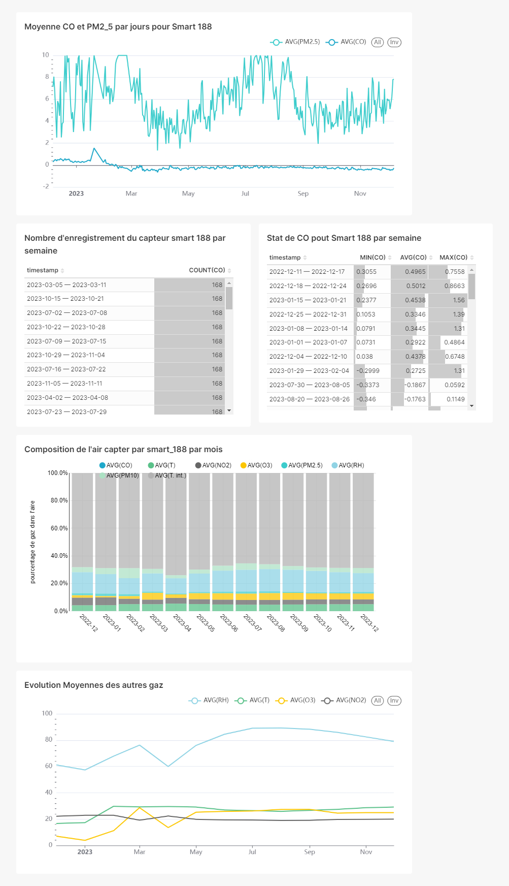
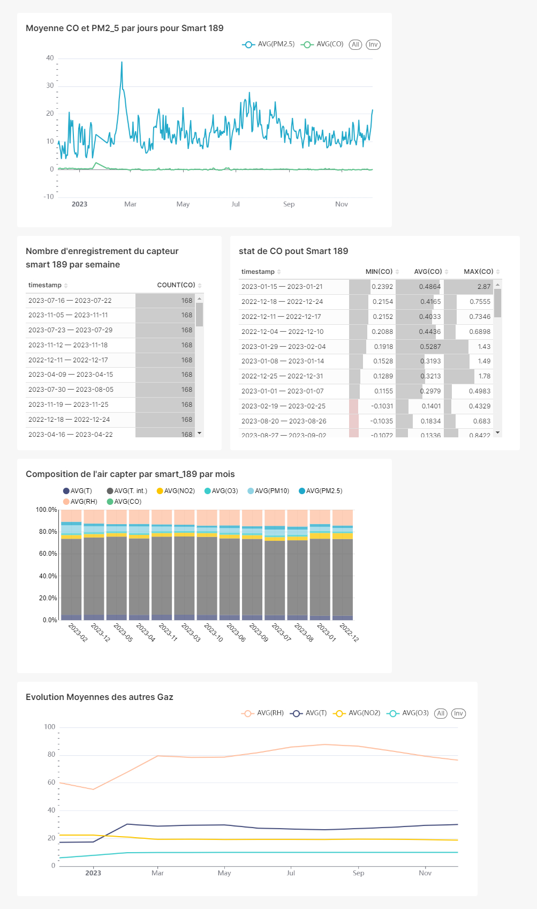

***
## Nebout Abraham 
***

# challenge_data354
# Projet de Stagiaire Data Engineer
***
#### Presentation du projet
Ce projet a été conçu dans le cadre du processus de recrutement pour un stage en ingénierie des données. L'objectif est d'évaluer mes compétences techniques en analyse métier, extraction et traitement de données, ainsi que mes compétences en programmation Python.

#### Objectif du Projet
Ce projet a pour but de mettre en place un ETL (Extract, Transform, Load) pour extraire les données horaires de l'API AirQuino, calculer les moyennes quotidiennes de CO et PM2.5 pour chaque capteur, stocker les résultats dans une base de données (Cassandra ou MongoDB), créer un Dashboard Superset pour visualiser les données, et enfin, proposer une méthode d'automatisation et de mise en production de l'ETL.
***
***
## La realisation du projet comporte trois phases.
1. [Extraction de Données, Calcul de la Moyenne de CO et de PM2.5 par Jour et Sauvegarde des Résultats](#general-info)
2. [Automatisation et Stratégie de Mise en Production](#technologies)
3. [Visualisation avec Superset](#installation)

***
***
#### packages neccessaires
```python
$ import requests
$ import pymongo
$ pandas as pd
$ from airflow import DAG
$from airflow.operators.python_operator import PythonOperator
$from datetime import datetime, timedelta
```
***
***

# Phase de Réalisation du Projet
***
### Phase 1: Extraction, Calculs et Stockage
Dans cette phase du projet, nous avons definit trois fonction : 

* def extraction(URL): Récupère les données d'un capteur via l'URL et retourne un dictionnaire d'informations sur le capteur ainsi qu'un DataFrame des données enregistrés par ce capteur.
```python
def extraction(url):
    response = requests.get(url)
    if response.status_code == 200:
        data = response.json()
        
        info = data['header']
        donnees =  pd.DataFrame(data['data'])
        
    else:
        return "erreur lors de la connection"
    
    return info, donnees

```
  
* def calcul_moy(dataframe): Prend en parametre les données d'un capteur  et retourne la moyenne quotidienne du CO et du PM2.5 sous forme de  DataFrame.
```python
def calcul_moy(data):
    df = pd.DataFrame({'date': data['timestamp'],'moy_CO': data['CO'] ,'moy_PM2.5': data['PM2.5']})
    df['date'] = df['date'].str.slice(stop=-9)   #supression des heures et minutes
    moyennes = df.groupby('date')[['moy_CO','moy_PM2.5']].mean().reset_index()
    return moyennes

```
* def insertion(dataframe, database, collection): Stocke les informations du DataFrame obtenu lors du calcul de moyennes de CO et de PM2.5 dans une collection spécifiée d'une base de données MongoDB.
```python
def insertion(data,db,collection):
    
    client = pymongo.MongoClient("mongodb://localhost:27017/" )
    database = client[db]
    collection = database[collection]
    
    for i in range(len(data)):
        res = {"date":data.iloc[i,0],"moy_co":data.iloc[i,1],"moy_pm":data.iloc[i,2]}
        result = collection.insert_one(res)
    
    client.close()

```
* def insertion_data(dataframe, database, collection): Stocke les données d'un capteur dans une collection spécifiée d'une base de données MongoDB.
```python
def insertion_data(data,db,collection):
    
    data['timestamp'] = data['timestamp'].str.slice(stop=-9)  #suppression des heure et des minutes 
    
    client = pymongo.MongoClient("mongodb://localhost:27017/" )
    database = client[db]
    collection = database[collection]
    
    for i in range(len(data)):
        res = {"date":data.iloc[i,0],"CO":data.iloc[i,1],"T":data.iloc[i,2],
              "T. int.":data.iloc[i,3],"NO2":data.iloc[i,4],"O3":data.iloc[i,5],
               "PM10":data.iloc[i,6],"PM2.5":data.iloc[i,7],"RH":data.iloc[i,8]
              }
        
        result = collection.insert_one(res)
    
    client.close()

```

***

***
## Phase 2: Automatisation et Mise en Production
 ## Automatisation avec Apache Airflow
Pour l’automatisation de notre ETL afin qu’il s’exécute chaque heure, nous pouvons utiliser un outil d'orchestration et de gestion de taches tel que **APACHE AIRFLOW**.

Un exemple de code python pour un DAG  a été fourni pour automatiser l'ETL dans la section AUTOMATISATION DE NOTRE CODE, s'exécutant toutes les heures, avec les étapes suivantes :

* Extraction des données pour chaque capteur
* Calcul des moyennes de CO et PM2.5 par jour
* Sauvegarde des résultats dans MongoDB
* Envoi d'un e-mail d'erreur en cas de non-exécution correcte du DAG.
  

 ## Stratégie de Mise en Production

Pour la mise en production de l'ETL, nous avons opter pour les étapes suivantes :

* #### Planification de l'exécution 
  Planifier quand et comment notre ETL sera exécuté. Cela peut être basé sur un calendrier.
* #### Surveillance des performances
  Mettre en place des outils de surveillance pour suivre les performances de l’ETL et recevoir une alerte en cas de problèmes.
* #### Maintenance régulière
  Prévoir un plan de maintenance pour l’ETL pour s’assurer qu’il reste à jour en cas de changements dans les sources de données.
* #### Documentation du processus ETL
  Documenter notre processus ETL pour faciliter la maintenance et le dépannage.
* #### Formation des utilisateurs potentiels.
  former les utilisateurs potentiels à l’utilisation  de l’ETL.

***

***
## Phase 3: Visualisation avec Superset
Elle a été réaliser en trois étapes :
#### Installation de Superset à l'aide de Docker
#### Connexion de Superset à la base de données
#### Création de deux Dashboards, un pour chaque capteur.

# VISIONNAGE DE QUELQUES IMAGES OBTENUES

***
***
## Dashbord du capteur smart_188

***
***
## Dashbord du capteur smart_189

***
***
## QUELQUE COMMENTAIRES DE MES DASHBORDS

*  Les tableaux de bord montrent que nos capteurs effectuent 168 enregistrements par semaine. Cependant, pour **la dernière semaine du mois de janvier 2023**, nos capteurs n'ont **enregistré que 35 enregistrements.**
*  Pour le capteur smart_188, le **taux de carbone** connais une **chute brusque** entre les mois de fevrier et mars 2023
*  Les tableaux de bord motrent les valeurs min, max et la moyenne pour le CO, par semaine, un filtre a ete ajouter pour plus de precision. 


***
## EN CONCLUSION
La réalisation de ce projet a été une expérience enrichissante qui m'a permis de mettre en évidence mes connaissances existantes tout en développant de nouvelles compétences. Au fil de ce parcours, j'ai pu démontrer ma capacité à concevoir, planifier et exécuter un projet de manière autonome, en intégrant des concepts que j'avais acquis précédemment.

Outre, ce projet représente bien plus qu'une simple démonstration de compétences techniques. Il incarne ma volonté d'apprendre continuellement, ma capacité à m'adapter à de nouveaux environnements, et ma détermination à exceller dans des projets ambitieux. Cette expérience a renforcé ma confiance dans mes capacités professionnelles tout en élargissant mes perspectives pour les projets futurs.

#### Les contributions et les remarques sont les bienvenues.

### Merci pour votre attention !
***
